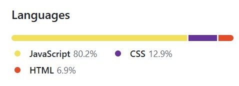
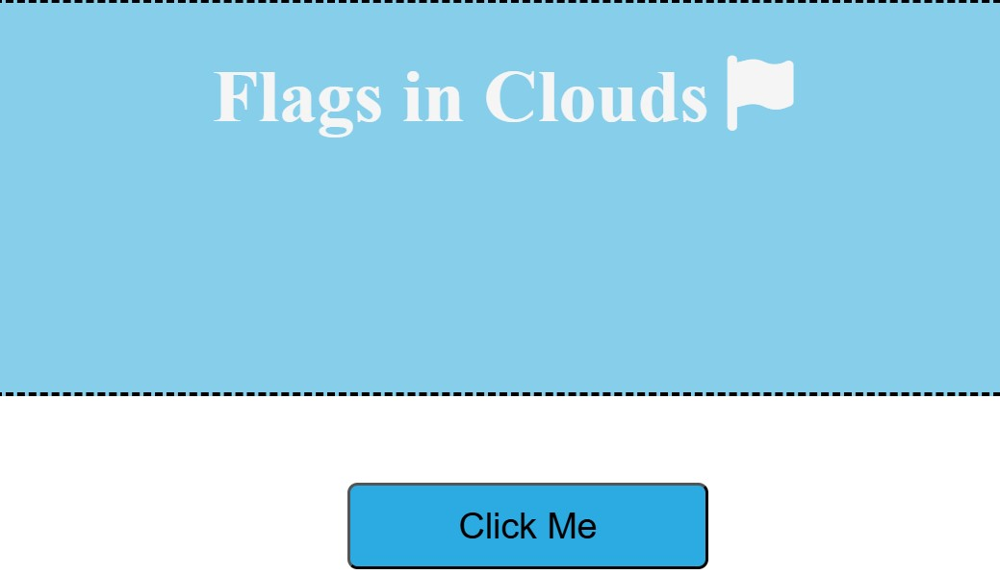
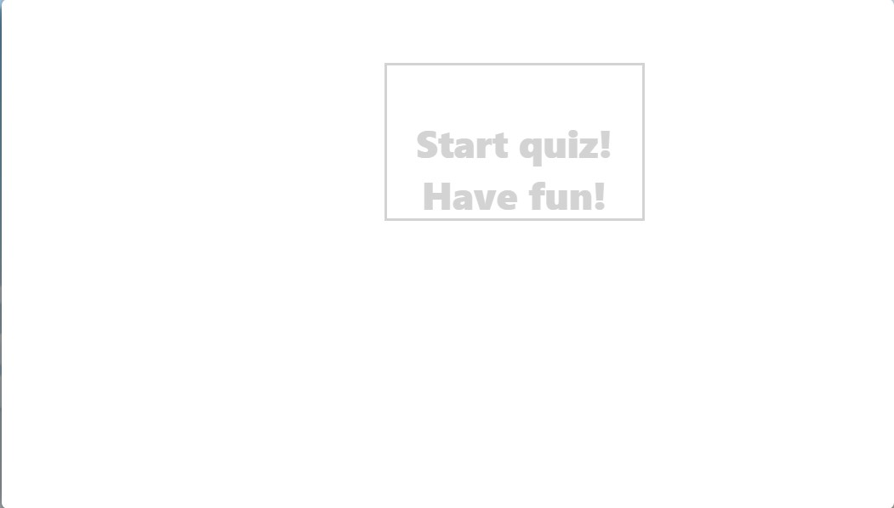
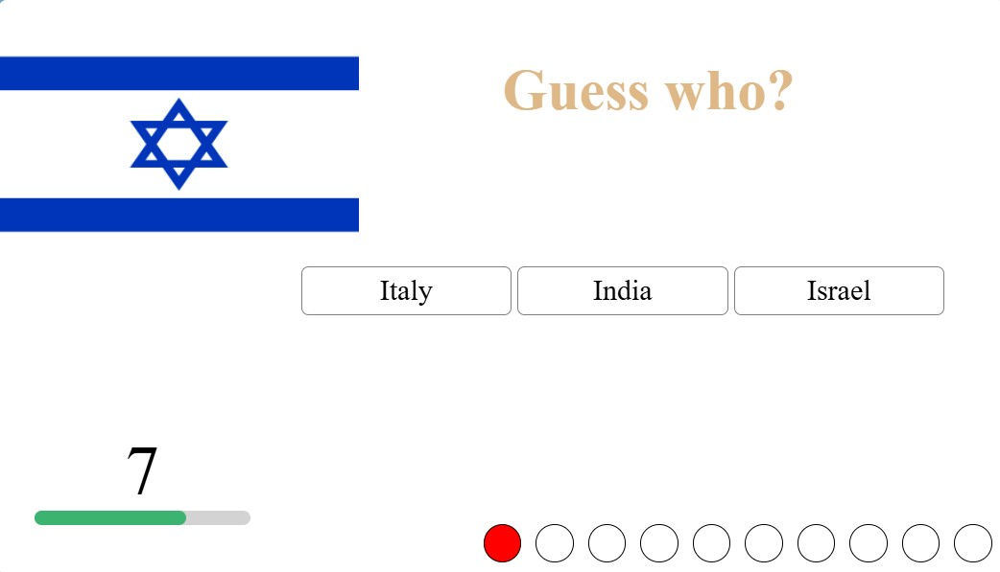
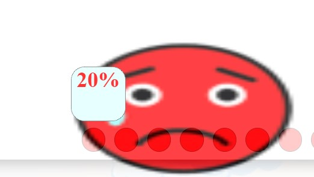
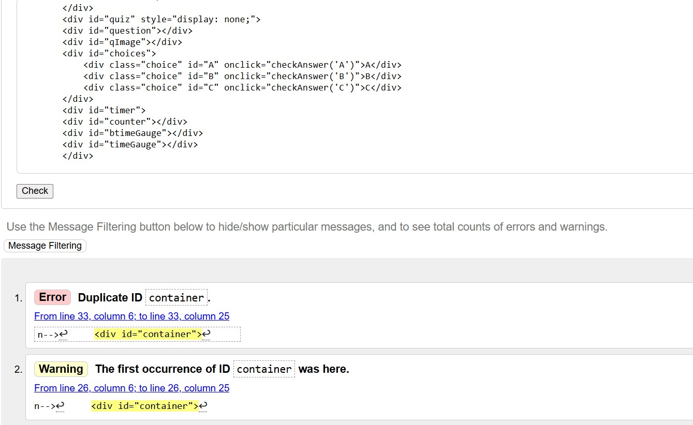
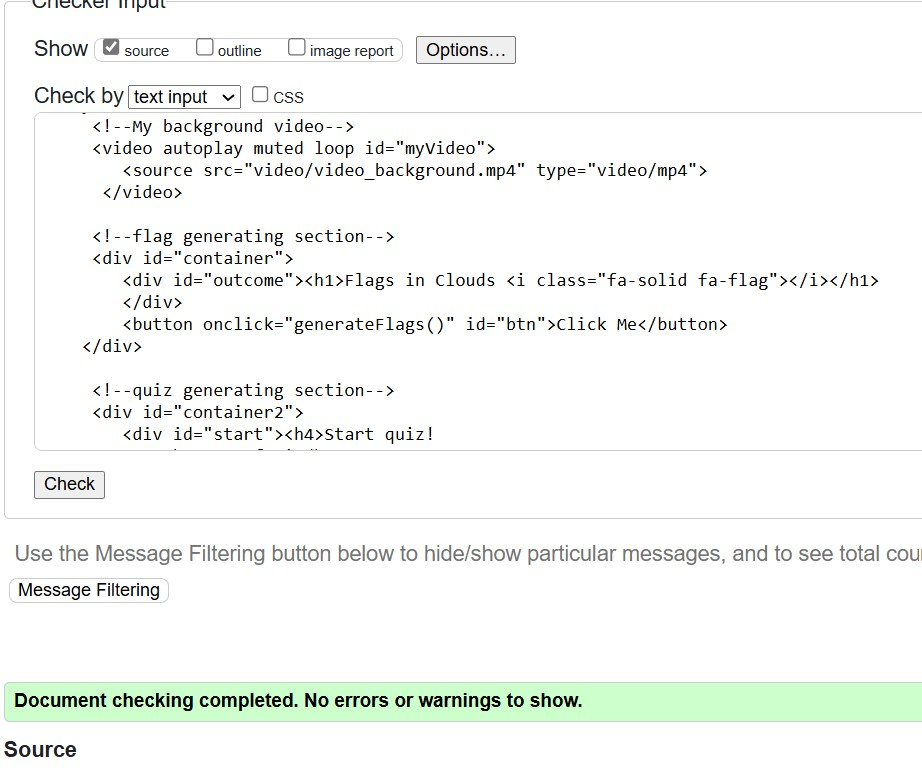
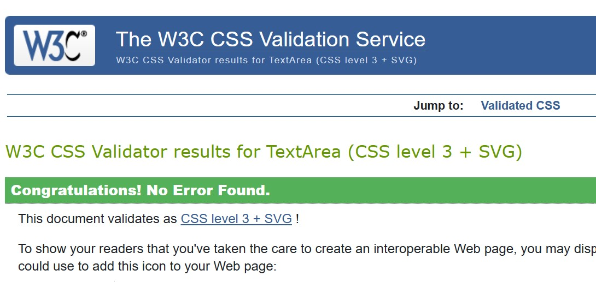

# Flags in Clouds

## Purpose of the Website:
The **Flags in Clouds** website is designed to provide an entertaining and educational experience focused on learning about world flags. The site serves two main functions:
1. **Flag Generation Feature** – Users can generate random flags of all the nations in our planet, helping them visually familiarize themselves with different country flags.
2. **Interactive Quiz** – A quiz challenges users to identify flags correctly, there will be a limited time to answer each question and reinforce their knowledge through an engaging gameplay format.

Although the website was intentionally designed for children at the age of primary school by combining an appealing bright colors and interactive learning approach, this website will make sure to make flag recognition enjoyable for users of all ages.

## User Story:
As a user who is interested in a world geography and flags, I want an engaging and interactive website where I can learn about different national flags through a fun quiz and a flag generation feature. This will help me to improve my knowledge of flags while enjoying an interactive experience.
 

This image is obtained from the github page to inform users the languages used in this project and to what levels they were used. It is clearly witnessed with more than 80% of JavaScript language used in this project, how user interactive and highly reciprocal the website is.

### The final project

This is the background video of moving clouds. The video is about 10 seconds long and it is played on auto and loop mode, which means the video plays automatically and continously when a user visits the website.
 
 
This is the first section of the website with a visible and clear name of the website, as well as a button informing the user to click it.
 

This is when the user clicks the button and start interacting with the webpage. The flag generating section changes its color design and content. An image of a nation`s flag is generated on top and the name of the country on the bottom. The <em>Click Me</em> text on the button is also changed to <strong>Next</strong> during this stage.
 

This is the second section of the website which will generate questions to test the knowledge of users on this topic. 
 

This image displays the quiz section in action and a question rendered to users. A text question /short message/ which is changed for every question is shown on the top that is followed by the image of the flag which needs to be recognised by the user. Three choices are presented to be selected to which only of them can be a possible answer. A countdown timer is placed on the left-bottom section to notify how much time a user has to make a decision and answer the question. There is also a score progress bar positioned on the right-bottom of the section to enhance user experience and inform how well they are doing in the quiz. Green colour is used to mark for when a users answers correctly and a red color when the wrong inswer is clicked or when no answer is received before the time runs out.
 

After the fun quiz game comes to an end a score will be revealed to the user. The result will be calculated and given to the user as a form of a percentage with an emoji image that reflects the performance of participants. 

## Credits
<ul>
<li>A <a href="https://en.wikipedia.org/wiki/List_of_national_flags_of_sovereign_states">Wikipedia</a> page is greatly used for this website as the main source for the flags and names of all sovereign nation states.</li>
<li>A cartoon and motion graphics of clouds with effects and annimation was used from <a href="https://www.youtube.com/watch?v=cYvTHYMb-Zk" target="_blank">this</a> YouTube video as the background layout of the webpage.</li>
<li>I have used <a href="https://favicon.io/">favicon</a>, in order to generate the small sized logo icon which is placed on the browser tab.</li>
<li>Another helpful source to thank in my list is<a href="https://coolors.co/image-picker" target="_blank">Color picker</a>, which supported this project to choose a colour palette that goes hand in hand with colourful theme I have chosen for this project. The source also have a significant feature that allows you to export the group of colours which I picked for my internal files.</li>
</ul>

<h2>Testing</h2>
<ul>
<li>I have made sure there are no broken links.</li>
<li>The site's layout, colour and interactivity are consistent and rationale.</li>
<li>The customer is not able to break the site by clicking unvalidated clicks. For instance when generating flags at random, or selecting an answer from the multiple choice questions.</li>
<li>All page elements function and display well on all media screen sizes. I have double checked the responsiveness of all pages on mobile, tablet and desktop screen sizes.</li>
<li>All types of multimedia content used in this project function and look well on different popular browsers. I have checked the deployed on "Microsoft Edge" and "Google Chrome".</li>
<li>I have confirmed multiple times that the main page is linked rightfully to the custom CSS file.</li>
<li>I have used an "alt" attribute in all image elements throughout the project, which provides a brief description of all non text elements of having a text equivalent for the visually impaired users.</li>
<li>The HTML page was tested using the official W3C validator and an error was detected as shown in the screenshot image below.</li>

<li>I have visited the booking page one more time, located where the error was thanks to the validator tool and fixed it. The error happened because two different elements were given an identical Id. I have managed to change the Id for one of the elements and now the web page is error free. See the screenshot image below.</li>

<li> I can now confirm that the custom CSS file in this project passes through the official W3 Jigsaw CSS validor with no issues. See the screenshot below.</li>

<li>All webpages are codded in a consistent manner to eaase readability, and there is no unneeded complexity or commented out code within the files.</li>
