# Flags in Clouds

## Purpose of the Website:
The **Flags in Clouds** website is designed to provide an entertaining and educational experience focused on learning about world flags. The site serves two main functions:
1. **Flag Generation Feature** – Users can generate random flags of all the nations in our planet, helping them visually familiarize themselves with different country flags.
2. **Interactive Quiz** – A quiz challenges users to identify flags correctly, there will be a limited time to answer each question and reinforce their knowledge through an engaging gameplay format.

Although the website was intentionally designed for children at the age of primary school by combining an appealing bright colors and interactive learning approach, this website will make sure to make flag recognition enjoyable for users of all ages.

<ul>
<li><a href="#user_story">User Story</a></li>
<li><a href="#final_project">The final project</a></li>
<li><a href="#credits">Credits</a></li>
<li><a href="#testing">Testing</a>
<ul>
<li><a href="#jest">Jest</a></li>
</ul>
</li>
<li><a href="#deployment">Deployment</a></li>
</ul>

<h2 id="user_story">User Story</h2>:
As a user who is interested in a world geography and flags, I want an engaging and interactive website where I can learn about different national flags through a fun quiz and a flag generation feature. This will help me to improve my knowledge of flags while enjoying an interactive experience.
 
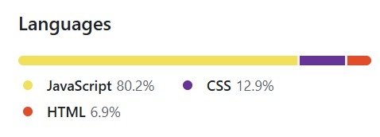

This image is obtained from the github page to inform users the languages used in this project and to what levels they were used. It is clearly witnessed with more than 80% of JavaScript language used in this project, how user interactive and highly reciprocal the website is.

<h3 id="final_project">Final project</h3>

This is the background video of moving clouds. The video is about 10 seconds long and it is played on auto and loop mode, which means the video plays automatically and continously when a user visits the website.
 
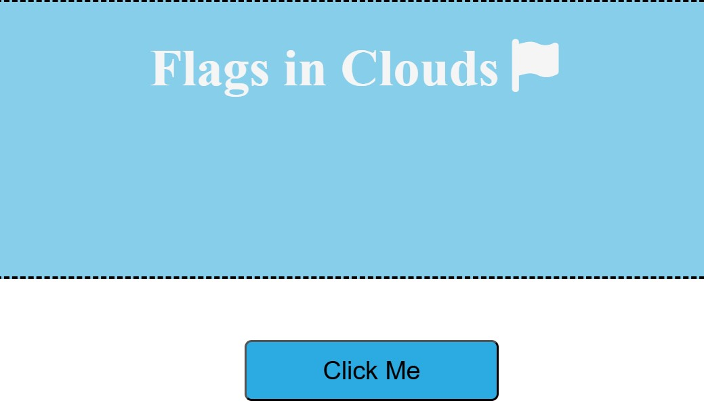 
This is the first section of the website with a visible and clear name of the website, as well as a button informing the user to click it.
 
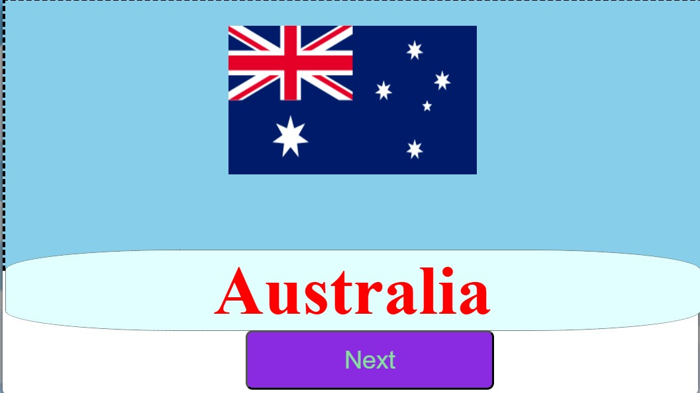
This is when the user clicks the button and start interacting with the webpage. The flag generating section changes its color design and content. An image of a nation`s flag is generated on top and the name of the country on the bottom. The <em>Click Me</em> text on the button is also changed to <strong>Next</strong> during this stage.
 
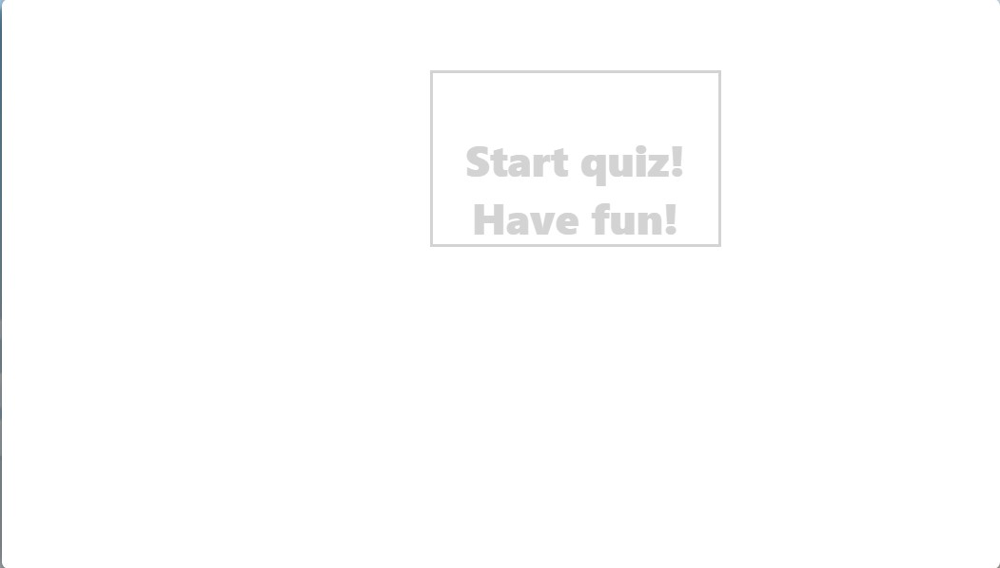
This is the second section of the website which will generate questions to test the knowledge of users on this topic. 
 
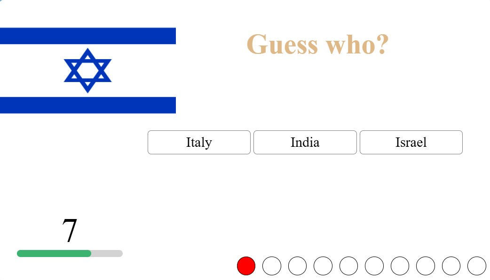
This image displays the quiz section in action and a question rendered to users. A text question /short message/ which is changed for every question is shown on the top that is followed by the image of the flag which needs to be recognised by the user. Three choices are presented to be selected to which only of them can be a possible answer. A countdown timer is placed on the left-bottom section to notify how much time a user has to make a decision and answer the question. There is also a score progress bar positioned on the right-bottom of the section to enhance user experience and inform how well they are doing in the quiz. Green colour is used to mark for when a users answers correctly and a red color when the wrong inswer is clicked or when no answer is received before the time runs out.
 
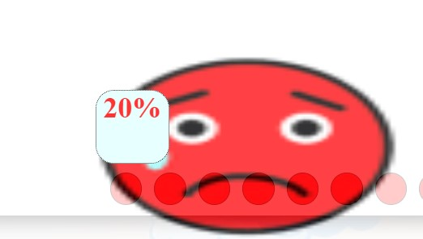
After the fun quiz game comes to an end a score will be revealed to the user. The result will be calculated and given to the user as a form of a percentage with an emoji image that reflects the performance of participants. 

<h2 id="credits">Credits</h2>
<ul>
<li>A <a href="https://en.wikipedia.org/wiki/List_of_national_flags_of_sovereign_states">Wikipedia</a> page is greatly used for this website as the main source for the flags and names of all sovereign nation states.</li>
<li>A cartoon and motion graphics of clouds with effects and annimation was used from <a href="https://www.youtube.com/watch?v=cYvTHYMb-Zk" target="_blank">this</a> YouTube video as the background layout of the webpage.</li>
<li>I have used <a href="https://favicon.io/">favicon</a>, in order to generate the small sized logo icon which is placed on the browser tab.</li>
<li>Another helpful source to thank in my list is<a href="https://coolors.co/image-picker" target="_blank">Color picker</a>, which supported this project to choose a colour palette that goes hand in hand with colourful theme I have chosen for this project. The source also have a significant feature that allows you to export the group of colours which I picked for my internal files.</li>
</ul>

<h2 id="testing">Testing</h2>
<table style="width:100%">
  <tr>
    <th>Testing environment</th>
    <th>Testing tool</th>
    <th>Expected outcome</th>
    <th>Errors reported</th>
    <th>Further actions</th>
  </tr>

  <tr>
  <td>Main Page</td>
  <td>The official W3C validator website</td>
  <td>The page to function as intended, to generate flags of all nations and an interactive quiz section to test the knowledge of users on the respected subject</td>
  <td>Two different elements were named with an identical Ids.</td>
  <td>The reported bug was fixed by renaming the Id of one of the elements.</td>
  </tr>

   <tr>
  <td>CSS custom page</td>
  <td>W3 Jigsaw CSS validor</td>
  <td>Apply desired styles and layouts to selected elements, as well as enhanced readability and semantics.</td>
  <td>No defects presented.</td>
  <td>No further action required.</td>
  </tr>

  <tr>
  <td>Internal links</td>
  <td>All buttons and linked explored and double checked in the main page.</td>
  <td>Users not to encounter broken links when intending to prompt desired actions in the website.</td>
  <td>No bugs detected whatsoever.</td>
  <td>No action required.</td>
  </tr>

  <tr>
  <td>Responsiveness</td>
  <td>Using media queries on the CSS custom page to ensure a consistent user experience whether accessed on a desktop computer, tablet or mobile phones</td>
  <td>So that users have the ability to adjust and adapt automatically to all media screen sizes.</td>
  <td>No errors.</td>
  <td>Not needed.</td>
  </tr>

  <tr>
  <td>JavaScript file</td>
  <td>The offical JSLint code analysis tool</td>
  <td>To statically and automatically analyse if the JavaScript source code we provided for our project complies with coding rules.</td>
  <td>No defects presented.</td>
  <td>No further action required.</td>
  </tr>
  </table>
<ul>
<li>I have made sure there are no broken links.</li>
<li>The site's layout, colour and interactivity are consistent and rationale.</li>
<li>The customer is not able to break the site by clicking unvalidated clicks. For instance when generating flags at random, or selecting an answer from the multiple choice questions.</li>
<li>All page elements function and display well on all media screen sizes. I have double checked the responsiveness of all pages on mobile, tablet and desktop screen sizes.</li>
<li>All types of multimedia content used in this project function and look well on different popular browsers. I have checked the deployed on "Microsoft Edge" and "Google Chrome".</li>
<li>I have confirmed multiple times that the main page is linked rightfully to the custom CSS file.</li>
<li>I have used an "alt" attribute in all image elements throughout the project, which provides a brief description of all non text elements of having a text equivalent for the visually impaired users.</li>
<li>The HTML page was tested using the official W3C validator and an error was detected as shown in the screenshot image below.</li>
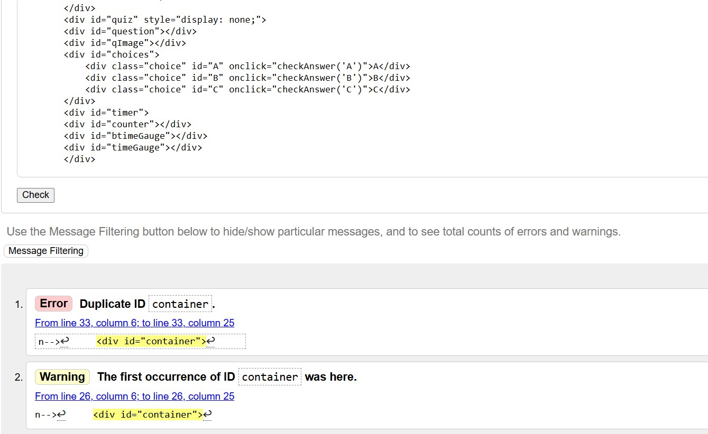
<li>I have visited the main page one more time, located where the error was thanks to the validator tool and fixed it. The error happened because two different elements were given an identical Id. I have managed to change the Id for one of the elements and now the web page is error free. See the screenshot image below.</li>

<li> I can now confirm that the custom CSS file in this project passes through the official W3 Jigsaw CSS validor with no issues. See the screenshot below.</li>
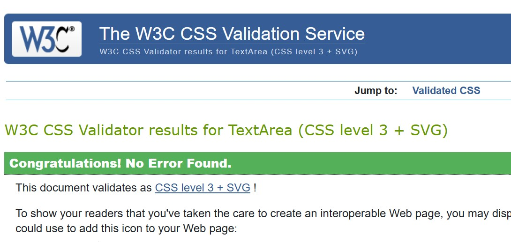
<li>I have tested the JavaScript source code of this project in the offical JSLint automative testing tool. This incredibly helpful website enabled me to double check and evaluate if all variables, values, semantics and functions in the JavaScript file complies with the rules and standards of coding. See the image below.</li>
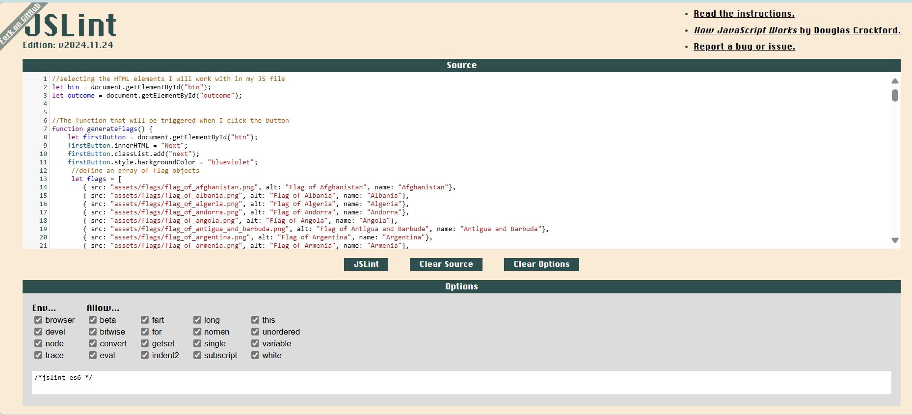
<li>All webpages are codded in a consistent manner to eaase readability, and there is no unneeded complexity or commented out code within the files.</li>

<h4 id="jest">Jest</h4>
Jest is a JavaScript testing framework that is designed to make sure correctness of any JavaScript codebase. This particular framework will allow you to write tests with an approachable, well known and highly interactive API that gives you results quickly.

Manual website testing is conducted by human testers manually checking the website through interaction with the site developed. Testers usually follow test cases but they can also explore freely. Manual testing is best for usability testing, exploratory testing and UI validation. On the other hand automative website testing uses scripts and software tools like Selenium or Cypress. This type of testing can run tests on multiple browsers and devices automatically. Automative website testing is best for regression testing, load testing and repetitive tasks.

Since 80% of the language used in this project was JavaScript, it is only rational to include a JavaScript testing methods to detect if any errors are presents in the functions and semantics of the <strong>script.js</strong> in my project. 

I will now walk you through the various steps I applied on how to get started with testing using Jest

<ol>
<li> The first step I took was to install Jest globally, as this was done in order to gain access to Jest's Command Line Interface (CLI). I must highly emphasise that <em>Node.js</em> must be installed first because Node Package Manager (npm) will be used as a library and registry for JavaScript software packages. 
Therefore, I went to my terminal and run the following command:  <strong>npm install -g jest</strong></li>
<li>The next step was to run 
<strong>npm init -y</strong> 
As a result this created a <em>package.json</em> file inside the folder I was accessing. The new file has the following content: 
{
  "name": "learning-jest", 
  "version": "1.0.0", 
  "description": "", 
  "main": "index.js", 
  "scripts": { 
    "test": "echo \"Error: no test specified\" && exit 1" 
  }, 
  "keywords": [], 
  "author": "", 
  "license": "ISC" 
}</li>
<li>The next stage of this process was to add Jest as a dev dependency to the project. 
<strong>rpm install --save-dev jest</strong> 
Then, I went to my <em>package.json</em> file and changed this part: 
"scripts": { 
    "test": "echo \"Error: no test specified\" && exit 1" 
  }, 
  <strong>To this:</strong> 
  "scripts": { 
    "test": "jest" 
  },</li>
<li>It was when I successfully reached this phase that I created a new file called <strong>script.test.js</strong> to enable me write my tests and allow me to practice testing individual units of code in isolation. The main purpose I carried out this specific type of testing was to ensure that each unit of code works as intended, and that the codebase was clean and reliable.</li> 
<li>Finally, I was ready to run and investigate my first test unit. So, I went to my terminal and simly run: 
<strong>npm test</strong></li>
</ol>
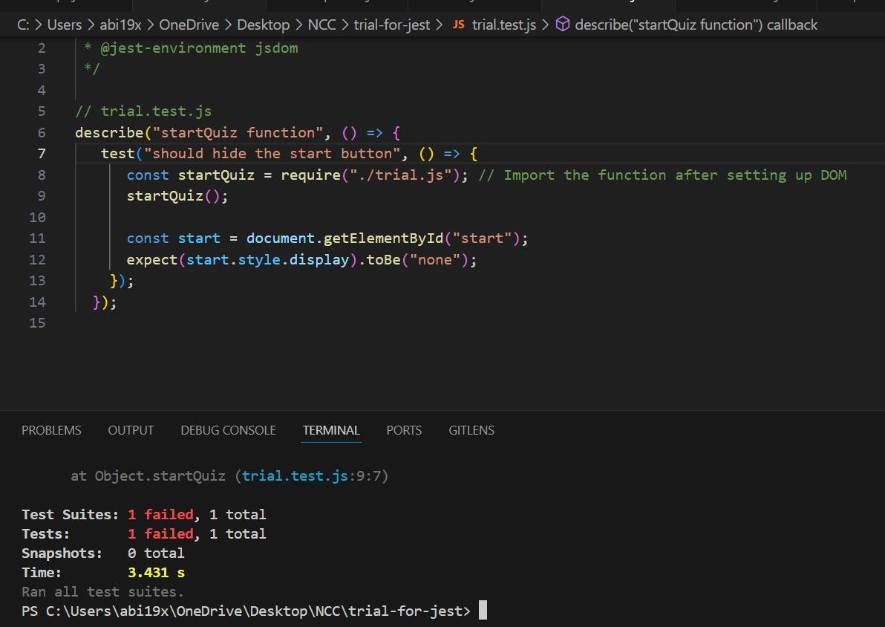
<ul>
<li>One of the main reason why I got this error was because <em>"jsdom"</em> is no longer included by default in the json package and needed to be installed separately. Hence, I run the following command in the terminal: 
<strong>npm install --save-dev jest-environment-jsdom</strong> 
The second part to fix this particular error was to explictly instruct Jest to use <em>"jsdom"</em> as the test environment. This was needed purposefully to update Jest configuration by adding the following object in my <em>package.json</em>file. 
{ 
  "jest": { 
    "testEnvironment": "jsdom" 
  } 
} 
</li>
<li>Another reason for this error was missing a <em>"DOM mock"</em>, which is a fake representation of a web page's structure to test code that interacts with the Document Object Model(DOM) without needing a real browser window. This simulated version of the DOM used in testing will allow developers for controlled and isolated testing. So I placed the DOM setup inside <strong>beforeeach</strong> to ensure a clean DOM for each test. This is why I imported the functions after setting up the DOM, to prevent any attempt from accessing the document before it was ready. What seemed to be a very complicated issue was resolved by adding the followng block to the testing file: 
 beforeEach(() => { 
    // Set up the DOM before each test 
    document.body.innerHTML = ` 
      <button-id="start"></button> 
      <div-id="quiz"style="display:none;">
 
    `; 
  });
  </li> 
</ul>
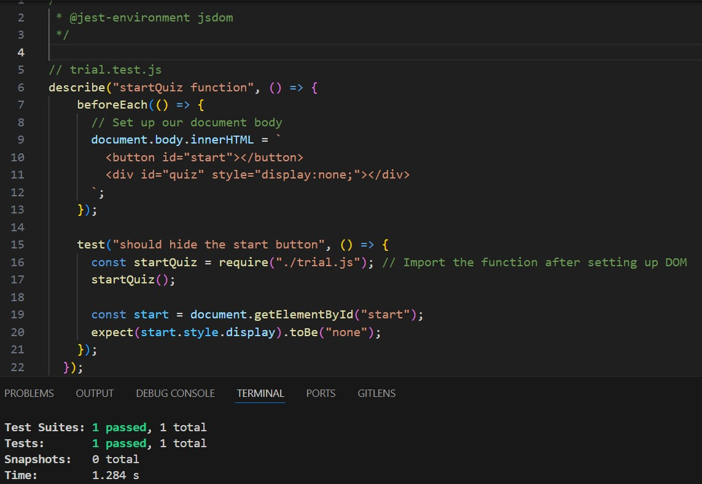

This picture displays the first test conducted now passes with no erros after the necessary adjustments were carefully implemented. The solution for my first error also helped as a fundamental principle and blueprint to fix identical errors that have encountered in future tests.
 

<h2 id="deployment">Deployment</h2>
The deployment process is going to help you to set up an environment for your live project, and it is pretty much straight forward to comprehend and apply.

1. Go to settings in your github repository
2. In the *code and automation* section, select **pages**
3. Set *'Source'* to **Deploy from a Branch/**
4. Select **main** from the branch section
5. Set **Folder** to **/(root)**, then click **Save**
6. Go to the **Code** tab, wait few minutes and refresh
7. On the right hand side click **github pages**
8. Last but not least, click **View Deployment** 
My deployed website can be found <a href="https://abi19x.github.io/Flags-in-Clouds/index.html">here.</a>